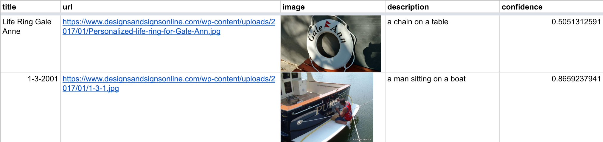

# SEO image optimization using Computer Vision
### A WordLift experiment to generate image captions

> Here is the link to the blog post on [Image SEO using AI](https://wordlift.io/blog/en/image-seo-using-ai/)  

This script uses **Python** with the Microsoft Computer Vision API (provided as part of the [Microsoft Cognitive Services](https://www.microsoft.com/cognitive-services)) to generate meta description for images stored on a WordPress website. 
You will need an API key from Microsoft and the export of your WordPress Media Library that can be done using the WordPress Export Tool. The result is a CSV file containing the URL of the image, the title of the image, the proposed description for the image and a confidence score. The script will skip the analysis if the description is already present in your media library.   

Here is an example generated with the same code (you will also find a Jupyter Notebook to run quick tests in this repo): the description, in this case, is written on the image. 

Not perfect, but still quite impressive.

## Instructions
To run the script simply download it and follow these steps: 

### 1. Export WordPress XML Media Contents
  - Login to your WordPress dashboard, and navigate to Tools Export.
  - Choose to export Media content.
  - Click Download Export File and the XML content will be downloaded in .xml format with a date on its file name.
### 2. Add your [Microsoft Computer Vision API Key](https://www.microsoft.com/cognitive-services/en-us/computer-vision-api) 
  - Update [line 15](https://github.com/cyberandy/image-captioning/blob/8d6c5028bdfaced0c4815a409454c6888bdc2fdc/generate-descriptions.py#L15) 
### 3. Replace the name of the XML file that you exported from WordPress
  - Update [line 30](https://github.com/cyberandy/image-captioning/blob/8d6c5028bdfaced0c4815a409454c6888bdc2fdc/generate-descriptions.py#L30)
### 4. Make sure you have all the required libraries installed 
If not use `pip install` to install the libraries below: 
  - time 
  - requests
  - operator
  - numpy 
  - pandas
  - xmltodict 
### 5. run the code from the terminal window
  - write `python generate-descriptions.py` 
  
The script will generate a file called *out.csv* that contains a list of the processed images containing their original title, the url of the image, the metadescription generated by the Computer Vision API and a confidence score (this will come handy when you will have to choose if it's worth keeping what the CV has suggested).

## Validation
I highly recommend to validate the results before importing the data back into your CMS. Google Sheet is a perfect way to help you revise and update the captions generated for your images. 

In Google Sheet, you can use the function `image(URL)` to display the image in a cell. 

## License
The code is free and licensed with the Apache 2.0 License.
